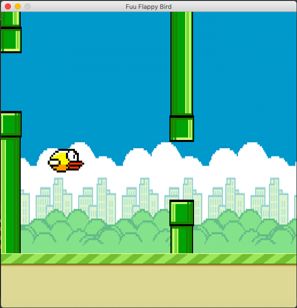

# FuuFlappyBird
    Flappy Bird clone game written in python using PySDL2

## How to Build
  
    Windows: (Visual Studio preferred)
      1.  Install the PySDL2 package. Simply type on the command line:
            python install pysdl2 --user
      2.  Create new python project within the IDE of your choice while making the Fuu_FlappyBird
          the source folder. Make sure to keep the same folder structure as in this repository in
          order to keep the same relative paths towards the libraries.
      3.  Set the main.py file to be the startup script for your run/debug configuration.
      4.  Run and enjoy!
    MacOS: (PyCharm preferred)
      (Same as Windows)
      
## Controls

    SPACE -> Fly Up

